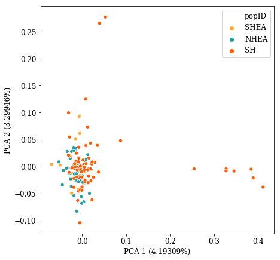
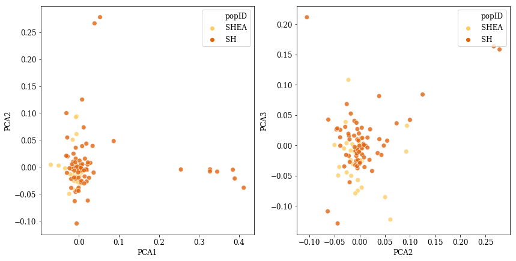
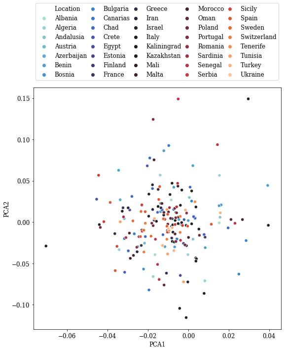
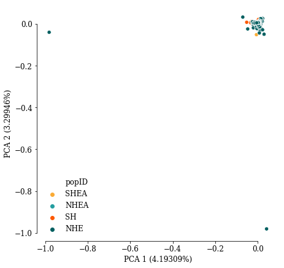
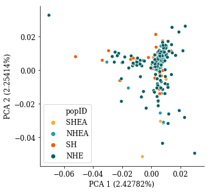

## PCA analysis walkthrough

**Preliminary results**

First, PCA analysis was preformed for the data with only necessary filtering to retain maximum coverage.

Short summary of filtering:
- Input file from Aurora: `cardui_migrdiv_indv.vcf.gz`
- Maximum missing % of individuals: 0.3
- Minor allele frequency cutoff fixed to 0.006: which corresponds to removing singletons and doubletons in dataset of 347 individuals
- Variant depth set to: 4 (see justification in Evernote)

We use custom functions (python: pandas, seaborn) to plot first exploratory graph:

We observe distinct outliers in Southern Hemisphere, all belonging to Namibia sampling site. Such pattern, along with excessive grouping of other populations may be an effect of LD in the sample.

Here we attempt to correct for LD, removing SNPs, where r^2>0.2 on 50Kb overlapping blocks (performed in plink).

LD pruning introduced minimal change in marker positions, several individuals are more spaced apart.

We will continue exploring this graph.

Samples from Northern Hemisphere are overlapping with majority of the rest, on the following graph we don't show them (NOTE: it's purely for visualization purposes, eigenvalues stay the same):

On this plot outliers from SH are even more obvious. We return to the table to extract exact IDs:
TBA

Let's explore "Hemisphere's" separately, starting from Southern Hemisphere:

We color plots by sampling location for further investigation:

Repeat the same plotting for Northern Hemisphere:

No structure is observed in Northern Hemisphere sample set, which agrees with hypothesis of shared migratory cycle.

Exploration of this graph is problematic, due to color scheme. Categorial color schemes typically don't allow for more then dozen of colors, cubehelix was temporary selected. Possible solution: sequential color scheme based on location proximity.

Let's explore sample set from Europe to compare with Megan's dataset. We zoom in to the center of plot space, ignoring three outliers.
(color palette: icefire)

**Exploring population structure in other MAF classes**
Here is briefly check population structure based on rare variants (MAF: 0.001-0.010, MAC: 1-4)

And zoomed w/o outliers:

